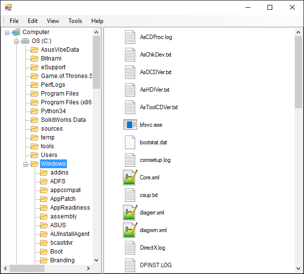

# Droid explorer : file exploration  [](http://servodroid.com)

[](https://www.nuget.org/packages/Droid_Explorer/)    [](https://raw.githubusercontent.com/ThibaultMontaufray/Tools4Libraries/master/License) [](https://travis-ci.org/ThibaultMontaufray/Droid-Explorer) [](https://coveralls.io/github/ThibaultMontaufray/Droid-Explorer?branch=master)  [](http://servodroid.com:8080/job/CI-Droid-Explorer/)  [](https://codeclimate.com/github/ThibaultMontaufray/Droid-Explorer)

# Usage

```csharp
Application.Run(new RichExplorer());
```

# Screens
<p></p>
<p></p>
